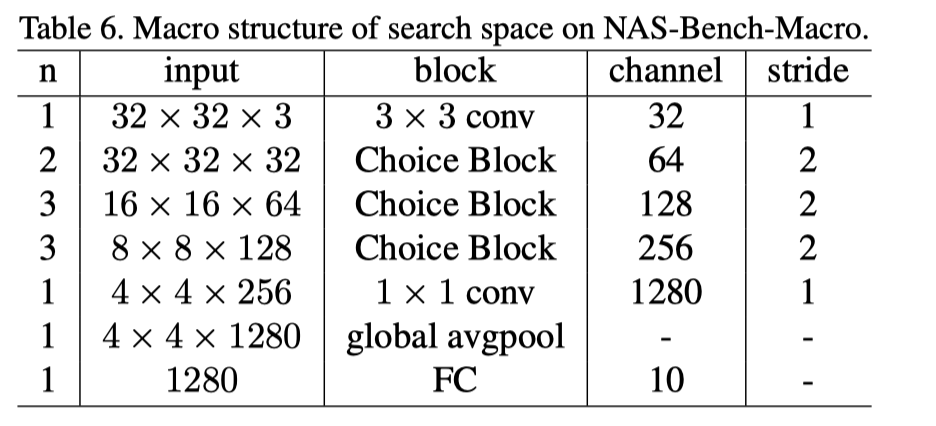

# NAS-Bench-Macro

This repository includes the benchmark and code for NAS-Bench-Macro in paper "Prioritized Architecture Sampling with Monto-Carlo Tree Search", CVPR2021.

NAS-Bench-Macro is a NAS benchmark on macro search space. The NAS-Bench-Macro consists of 6561 networks and their test accuracies, parameters, and FLOPs on CIFAR-10 dataset.

**Each architecture in NAS-Bench-Macro is trained from scratch isolatedly.**

## Benchmark
All the evaluated architectures are stored in file `nas-bench-macro_cifar10.json` with the following format:

```
{
    arch1: {
        test_acc: [float, float, float], // the test accuracies of three independent training
        mean_acc: float, // mean accuracy
        std: float, // the standard deviation of test accuracies
        params: int, // parameters
        flops: int, // FLOPs 
    },
    arch2: ......
}
```

## Search Space
The search space of NAS-Bench-Macro is conducted with 8 searching layers; each layer contains 3 candidate blocks, marked as _Identity_, _MB3_K3_, and _MB6_K5_.

* _Identity_: identity connection (encoded as '0')
* _MB3_K3_: MobileNetV2 block with kernel size 3 and expansion ratio 3
* _MB6_K5_: MobileNetV2 block with kernel size 5 and expansion ratio 6

### Network structure


## Statistics
### Visualization of the best architecture


### Histograms


## Reproduce the Results
### Requirements
```
torch>=1.0.1
torchvision
```

### Training scripts
```shell
cd train
python train_benchmark.py
```
The test result of each architecture will be stored into `train/bench-cifar10/<arch>.txt`

After all the architectures are trained, you can collect the results into a final benchmark file:
```shell
python collect_benchmark.py
```

---

## Citation
If you find that NAS-Bench-201 helps your research, please consider citing it:

```
```
